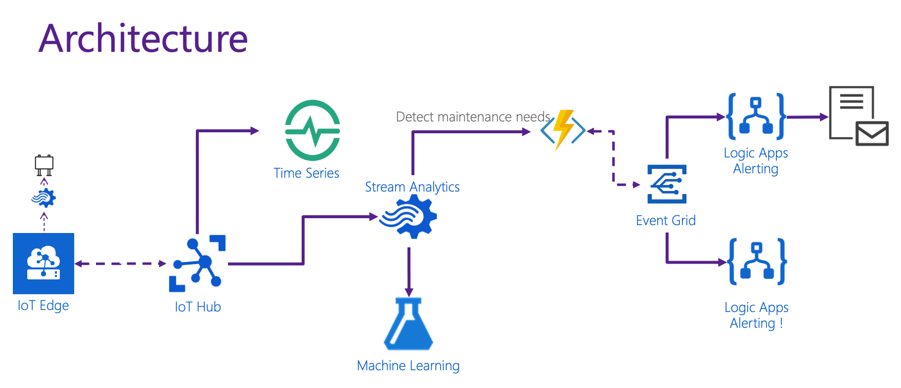

# Time traveling with Microsoft Azure

This Repository contains all source code for the time series example that processes telemetry information from 100 simulated engines.

[Presentation can be found here](resources/samvanhoutte-time-travel.pdf)

## Architecture

The overal architecture consists of the following components:

- **Engine telemetry simulator**:  netcore simulator that can be used as IoT Edge module or just as a vanilla Docker container.  [(Details)](./docs/simulator.md)
- **IoT Hub**: cloud based telemetry ingestion, having every simulated engine represented as a device
- **Time Series Insights (TSI)**: Timeseries database instance in Azure that ingests all telemetry and allows for time series exploration
- **Azure Data Explorer (ADX)**: The powerful data engine on which TSI is built.  
- **Azure Machine Learning**: Workspace that performs training of predictive maintenance model and hosts it as a service
- **Azure Stream Analytics**: Streaming instance that can process and perform standing queries in the incoming telemetry stream and uses the above mentioned model
- **Event Grid**: The event driven service that will be used to publish predictive maintenance events to and seperate handling of events from the detection of events
- **Azure Logic Apps**: The workflow service that will handle the different predictive maintenance events

## Pre-requisites

- An Active Azure Subscription
- A resource group with the following resources: IoT Hub, Azure Machine Learning Workspace, Time Series Insights environment, etc.  (arm template will be provided later)
- For the actual Machine Learning training, following these steps (to do)

# Detailed documentation

